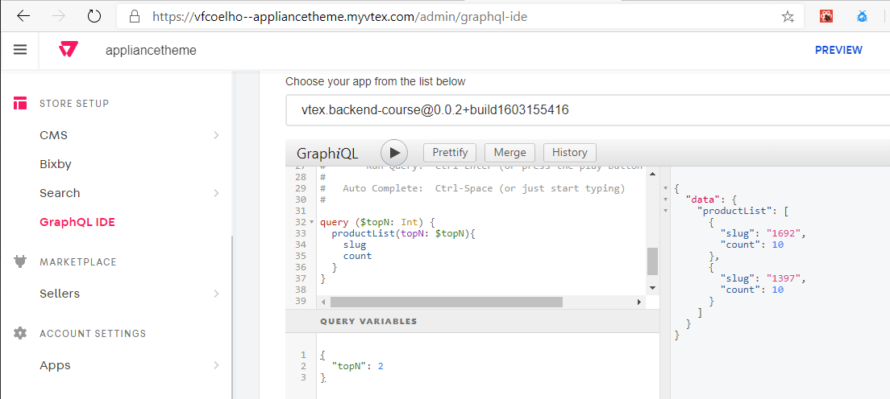
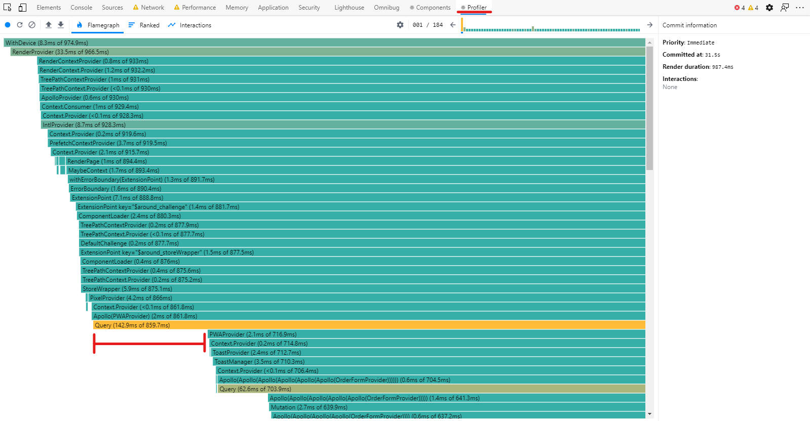

# VTEX Notes

## About this repo:

This is a study repository about VTEX IO based on lessons taken from VTEX.
The goal of this repo is to provide useful examples of various implementations
using all technologies provided by VTEX IO. It implements a store and its support 
structures to illustrate how more advanced builds can be made.

You will find different projects in this repository. Each of them is a separate
example repository cloned from VTEX public github account. Each of them is needed
for this example store to properly work and they are all contained in this single 
repository for the sake of simplicity of the overall example outcome.

These are the projects here contained and its purposes:
Project | Description
--------|------------
[minimum-boilerplate-theme](./minimum-boilerplate-theme) | The **Store Theme**. It holds the store frontend and examples on how to manipulate native and custom blocks as well as its styles and structures.
[store-block-template](./store-block-template) | A custom block. It shows how to create a custom component to be later used in a store theme project. It also contains examples of how to consume internal **VTEX APIs**, how to expose configurations in **Site Editor** and how to handle **localization** for VTEX IO apps.
[service-course-template](./service-course-template) | A template project containing examples of a service implementation. It holds examples on consuming VTEX clients for manipulating Master Data registries as well as receiving calls and handling them by implementing clients, resolvers, handlers and clients.
[events-example](./events-example) | A mock project to generate test events for `service-course-template`.
[react-app-template](./react-app-template) | A template containing an admin app example. Showing how to add items to admin menu, handle menu search and service integration. 
[service-example](./service-example) | A service example on how to use VTEX implemented services as dependencies.

## Useful Links

⭐ [Guides](https://developers.vtex.com/docs)

⭐ [Docs](https://vtex.io/docs)

⭐ [Changelog](https://developers.vtex.com/changelog)

⭐ [CLI](https://vtex.io/docs/recipes/development/vtex-io-cli-installation-and-command-reference/)

⭐ [Components](https://vtex.io/docs/components/all)

⭐ [GitHub](https://github.com/vtex-apps)

⭐ [Minimum Boilerplate](https://github.com/vtex-apps/minimum-boilerplate-theme)

⭐ [CSS Handles](https://developers.vtex.com/docs/vtex-io-documentation-using-css-handles-for-store-customization)

⭐ [Demo Store Theme](https://github.com/vtex-apps/demostore-theme)

⭐ [Store Block Template](https://github.com/vtex-trainings/store-block-template)

⭐ [Store Theme](https://github.com/vtex-apps/store-theme.git)

⭐ [Customizing Styles](https://developers.vtex.com/vtex-developer-docs/docs/vtex-io-documentation-5-customizingstyles)

⭐ [Service Template](https://github.com/vtex-trainings/service-course-template)
 - [Service Example](https://github.com/vtex-apps/service-example)
 - [API Clients](https://github.com/vtex/commerce-io-clients)
 - [Node API Client](https://github.com/vtex/node-vtex-api)
 - [IO Clients List](https://github.com/vtex/node-vtex-api/blob/ccf4d8f8d3208007c4bfd558baf979df8d825af8/src/clients/IOClients.ts)
 - [VTEX IO Clients Document](https://www.notion.so/How-to-use-and-create-Clients-on-VTEX-IO-1dbd20c928c642d0ba059d5efbe7874b)

⭐ [GraphQL Example](https://github.com/vtex-apps/graphql-example)

⭐ [GraphQL IDE](https://github.com/vtex-apps/admin-graphql-ide)
 - [Internal Admin IDE](https://{wortkspace}--{store}.myvtex.com/admin/graphql-ide)
 - [App Internal IDE](https://{workspace}--{store}.myvtex.com/_v/private/{vendor}.{app-name}@{version}/graphiql/v1)

⭐ [React App Template](https://github.com/vtex-apps/react-app-template)

⭐ [App Whitelist Form](https://docs.google.com/forms/d/e/1FAIpQLSfhuhFxvezMhPEoFlN9yFEkUifGQlGP4HmJQgx6GP32WZchBw/viewform)

⭐ [VTEX Design System](https://styleguide.vtex.com/) (For developing admin interfaces)

⭐ [VTEX APIs](https://developers.vtex.com/vtex-developer-docs/reference/get-to-know-vtex-apis)

⭐ [Test Tools](https://github.com/vtex/test-tools/tree/master/examples)
 - [Test Example](https://github.com/vtex-apps/condition-layout/blob/master/react/ConditionLayout.test.tsx)

Other References:
- [Tachyons](https://tachyons.io/)
- [Pexels](https://www.pexels.com/) free stock photos
- [Subatomic Design Systems](https://daneden.me/2018/01/05/subatomic-design-systems/)


## Useful Commands
Command | Description
----|----
`npm i -g vtex` | installs vtex toolbelt
`vtex login {accountName}` | logs to a specific account
`vtex whoami` | shows workspace and login information
`vtex use workspace-name` | creates and switches to a workspace
`vtex list` | lists dependencies, installed apps and liked apps in current workspace
`vtex unlink --all` | clears all links
`vtex workspace reset` | clears current workspace content
`vtex link -c` | links current folder code and assets to logged workspace
`vtex browse` | open workspace in browser at address: `https://{workspace}-{accoutnName}.myvtex.com`
`vtex local token` | Shows your personal VTEX [JWT](https://jwt.io/) development token


## Notes

⭐ In VTEX IO, the accounts have three types of workspaces, as follows: [master](https://vtex.io/docs/recipes/store/promoting-a-workspace-to-master/), [producton](https://vtex.io/docs/recipes/store/creating-a-production-workspace) and development.
 - Workspaces are exact copies of your site front. They share the backend information, but have front configuration segregation. Meaning that everything that is under CMS will be unique to the workspace, but information such as price, catalog, and everything else will be the same for all workspaces.
 - **Development Workspace**: you can link, install, and publish apps in this workspace. It is not available to common customers, meaning one should need to login to VTEX to see it.
 ```
 vtex publish
 vtex install [{vendor}.{appName}@{version}]
 ```
 - **Production Workspace**: Can be used with VTEX A/B Testing tools and can be promoted to *master*. Can't be linked and can be available to common customers.
 ```
 vtex use {WorkspaceName} --production
 ```
 - **Master Workspace**: Unique workspace that serves the store front for customers. Only one master can exist at the same time.

⭐ Enable CSS Inspector by adding `?__inspect` at the end of url, like so: 
 ```
 https://yourworkspace--youraccount.myvtex.com?__inspect
 ```

⭐ Store Theme
 - > Link `minimum-boilerplate-theme`

⭐ Custom Blocks
 - > To see the `countdown` block working properly, first link the `store-block-template` as it is a `minimum-boilerplate-theme` dependency

⭐ Services
 - > To see the `service-course-template` service working properly, first link the `events-example`
   > Additionally, you need to access the [health check](https://{workspace}--{store}.myvtex.com/_v/app/events-example/hcheck) url to start generating events
 - VTEX IO Services are a way to provide a complete customization environment. By creating services, one can create back-end hosted on VTEX
 - VTEX IO supports services written in `node` or `dotnet`
 - Services run in `Kubernets`
 - One can expose internal or external routes supporting `rest` or `graphql`
 - **Events are isolated by workspace**
 - `service/node/`
   - `handlers` handles incoming external HTTP calls
   - `event` handles internal events
   - `clients` manipulate internal resources
   - `resolvers` handles graphql calls
 - All clients *export* a *function* that receives an object of type **Context**
 - *GraphQL* is the **only interface** between service apps and front end apps
   - Testing your GraphQL resolvers:
   
      ```graphql
      query ($topN: Int) {
         productList(topN: $topN){
            slug
            count
         }
      }
      ```
      ```json
      {
         "topN":2
      }
      ```
      ---
      ```graphql
      query ($slug: String) {
         productInfo(slug: $slug){
            count
         }
      }
      ```
      ```json
      {
         "slug":"1307"
      }
      ```
⭐ Admin Apps
   - **Menu item definition:**
      - `navigation.json` defines the menu items that will be added to the admin site menu
      - `routes.json` defines the component mappings for each menu item defined in the `navigation.json` file
      - both files should work in tandem with their items being related through the `path` node from each file
         > the **path** in *navigation.json* should be like `/admin/{{your_path}}`

         > and the **path** in *routes.json* should be like `/admin/app/{{your_path}}`

## Performance Tips

⭐ `__fold__` **block**
 - the fold block sets a lazy load threshold. Whatever is below the `__fold__` block will load after the page load is complete and are within scroll frame.

⭐ **Menus**
 - Menus load in every page. That makes them a major performance concern, since they have a site wide impact.
 - One technique to reduce menu loading time in VTEX IO is to define its items as props instead of children blocks.
 - In cases where one might have sub menus declared, the above tip might not work. But one can still use it on the menu leaf items (the last elements on the menu tree). Also, the sub menu items load can be deferred.

⭐ **Images**
 - Images can have its size significantly reduced before being uploaded by using tools such as [Squoosh](https://squoosh.app/).
 - We can also tell VTEX IO to resize images at the server side using VTEX IO server side rendering features. To do that, set the `width` or `maxWidth` **props** in the image blocks such as `product-image`, `product-summary-image` and `image`.
 - It also helps to use all images from store assets instead to use external sources. That way, the image is served by VTEX CDN.

⭐ **Search**
 - Search behavior can also impact on site performance. One can configure the `store.search` component `context` prop to improve its performance. `"skusFilter": "FIRST_AVAILABLE"` returns the first skus available instead of all available and `"simulationBehavior": "skip"` skips price simulation, consuming cached price for each sku.

⭐ **Tools and other tips**
 - [Lighthouse](https://developers.google.com/web/tools/lighthouse)
    - Google dev performance tool
 - [Page Speed Insights](https://developers.google.com/speed/pagespeed/insights/)
    - Same as lighthouse, but for more standardized connection parameters since it's not executed in dev's machine, but in a server with control over connection and context variables
    - Take a look at the **Lighthouse Scoring Calculator** to check what is the metric that could bring the biggest gain on performance
 - [Web.dev](https://web.dev/)
    - Performance concepts and techniques documentation
    - Each metric in *lighthouse* has a different way to be improved
 - 
    - Use this on a incognito window
    - One can simulate the load of the page by using the performance tab on the browser dev tools. This will generate a load report that can be used to identify how each metric might be impacted during load and what files might be the offenders.
 - 
    - VTEX has exposed many configurations regarding performance tweaks
    - ❗ Test these features before deploying. These features should be used with caution. Since they are in CMS section of the admin, they should be applied to the workspace only.
      - One can test these configurations by enabling them in a production workspace
      - To access and test a production workspace, one can set the `workspace` query string variable to the name of one's validation production workspace.
      - Also, the `v` query string variable can be used to set a different *random* number to invalidate the cache of the workspace
      - > https://{your domain}.com/?workspace={workspace name}&v={arbitrary number}
 - [React Dev Tools](https://chrome.google.com/webstore/detail/react-developer-tools/fmkadmapgofadopljbjfkapdkoienihi)
    - 
   - The profiler can show what components are taking most time to load.
   - Gaps mean potential performance opportunities
   - Use this profiler assessment in production workspaces